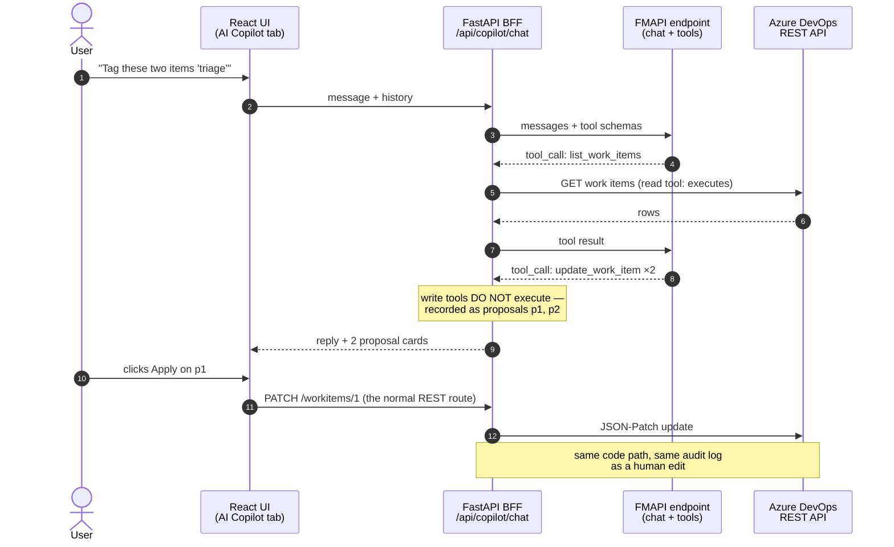
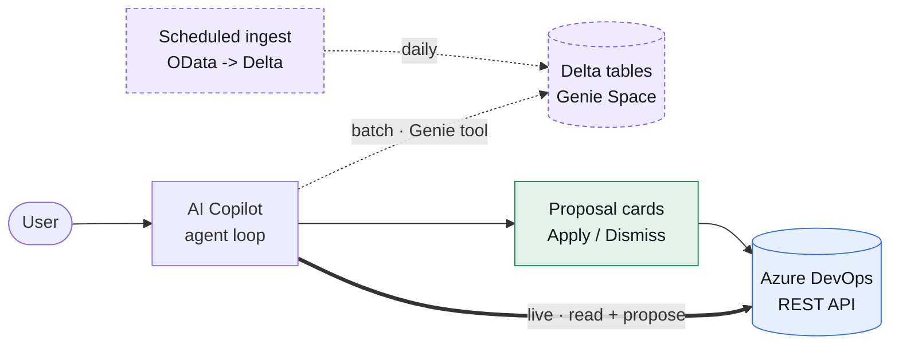

> Part 3 of the **ADO Companion** series. Part 1 built the app and the delivery pipeline; Part 2 chose OData for the analytics plane. This one is about the moment the roadmap changed shape: we stopped building a smarter dashboard and started building an **agent** — one that creates work items, cleans up descriptions, and tags a sprint's worth of backlog, with every change gated behind a human click.

<!-- 📸 Screenshot slot — HERO: The AI Copilot tab mid-conversation: read-tool chips at the top of an answer, and a proposal card ("Update work item #4") with Apply / Dismiss buttons. This is the whole thesis in one image. -->

---

## TL;DR

We added an **AI Copilot** tab to ADO Companion: a tool-calling agent running on a **Databricks Foundation Model APIs serving endpoint**, wired to the same FastAPI backend the rest of the app uses. The design rests on three decisions:

1. **The agent acts, it doesn't just answer.** Reading is table stakes; the value is *create this work item, fix that description, tag these five items*.
2. **Propose-then-apply.** The agent's writes never execute directly. Each one comes back as a proposal card; clicking **Apply** routes through the exact same REST endpoint a human edit uses — same audit log, same permissions, same code path.
3. **Everything is config.** The model endpoint name and the tracing experiment are per-workspace secrets. Moving from a personal dev workspace to a corporate one is a secret swap, not a rewrite.

And a structural bonus: the **Genie Space from Part 2 didn't get replaced — it got demoted to a tool.** The agent calls it when a question is historical, and answers from the live API when it isn't.

---

## 1. The realization: BI answers questions, but work is verbs

The Genie analytics chat from Phase 3 worked. Ask "how many open work items by state," get a real answer with a real table behind it. But watching actual usage made something obvious: the questions were almost always a *prelude to an action*. You ask what's stale **because you want to clean it up**. You ask who's overloaded **because you want to reassign something**.

A BI chat can't do any of that. Genie is, by design, read-only SQL over Delta tables. The wish list that accumulated looked like this:

- Create work items from a sentence ("make a task to tighten the release checklist, assign it to me").
- Edit and *clean up* work items — fix weak descriptions, normalize tags, set iterations.
- Eventually: review PRs and comment on files, generate PDF/Excel artifacts, make gated table edits.

That's not a chart with a better prompt. That's an **agent with tools** — and it forced a genuinely different architecture.

---

## 2. The decisions that shaped it

Same discipline as Part 1: name the constraints, let them pick the design.

| Decision | Choice | Why |
|---|---|---|
| **Where does the model run?** | Databricks FMAPI serving endpoint, name from config | Our runtime-AI policy is Databricks-native only — no external AI vendor calls in the product. FMAPI endpoints speak standard chat-completions with function calling, so the agent code doesn't care which model is behind the name. |
| **What can the agent touch?** | Only what the BFF already exposes | The Phase 4B CRUD work (create/update/comment, identity search, iterations) *is* the tool library. The agent gets no private side door — it literally cannot see or do more than the app itself. |
| **Do writes execute in the loop?** | Never. Propose-then-apply | AI write access is the part that fails a security review. Making every mutation a human-approved proposal that flows through the normal REST route means the audit log can't tell an AI-initiated change from a human one — because *mechanically it is one*. |
| **What about the Genie Space?** | It becomes one tool among many | One chat surface. The agent routes historical/BI questions to Genie and live questions to the REST tools, and is required to say which plane an answer came from. |
| **Model quality vs. availability?** | Endpoint name is a secret | Dev runs `databricks-llama-4-maverick` (Free Edition rate-limits the Claude endpoints to zero). The corporate workspace flips one secret to `databricks-claude-sonnet-5`. Zero code changes. |

The through-line: **the agent is a client of the app, not a superuser of it.**

---

## 3. Propose-then-apply: the load-bearing decision

Everything else is plumbing; this is the pattern worth stealing.

The agent loop distinguishes two kinds of tools:

- **Read tools execute immediately** — list work items, get detail, search identities, list PRs and builds, pull the analytics summary. Reading through the app's own client is safe by construction.
- **Write tools never execute in the loop.** When the model calls `create_work_item` or `update_work_item`, the server *records* the call — name and arguments — and returns it to the UI as a **proposal**. The model is told "recorded, the user will review it," and moves on.

The UI renders each proposal as a card: a human-readable title, the fields as a table, and **Apply / Dismiss** buttons. Apply doesn't invoke anything agent-specific — it calls `PATCH /api/projects/{p}/workitems/{id}`, the very endpoint the edit drawer uses. Which means:

- The **audit middleware** logs it identically (who, what, when, outcome).
- The **permission surface** is identical — the agent can't be phished into a write path the UI doesn't have.
- Rolling the feature back would leave zero orphaned infrastructure. The agent is additive.



<details class="diagram-note">
  <summary>Diagram description (text version)</summary>
  <p>A sequence diagram with five vertical lifelines, left to right: User, React UI (AI Copilot tab), FastAPI BFF, FMAPI endpoint, Azure DevOps REST API. The user sends "Tag these two items 'triage'" to the UI, which forwards it to the BFF, which sends messages plus tool schemas to the FMAPI endpoint. The model responds with a `list_work_items` tool call; the BFF executes it against Azure DevOps and returns the result to the model (annotate this exchange "read tools execute immediately"). The model then responds with two `update_work_item` tool calls; a highlighted note over the BFF says "write tools DO NOT execute — recorded as proposals." The BFF returns the reply plus two proposal cards to the UI. Finally, the user clicks Apply, and the UI calls the ordinary REST route (PATCH /workitems/1) through the BFF to Azure DevOps, with a closing note: "same code path, same audit log as a human edit." The visual message: the AI's writes detour through a human click and rejoin the normal path.</p>
</details>

<!-- 📸 Screenshot slot: A proposal card close-up — "Update work item #4" with the field table, Apply/Dismiss, and (in a second shot) the green applied chip after clicking. -->

---

## 4. The tool registry: your BFF is already the SDK

The most satisfying part of the build was how little new surface it required. The Phase 4B work — full work-item CRUD, identity search, comments — had already forced clean, typed methods on the ADO client. The tool registry is those methods with JSON-Schema descriptions stapled on:

| Tool | Kind | Backed by |
|---|---|---|
| `list_work_items`, `get_work_item`, `list_work_item_comments` | read | the same client methods the Work Items tab uses |
| `search_identities` | read | the assignee picker's endpoint |
| `list_pull_requests`, `list_builds` | read | the PR / Pipelines tabs' endpoints |
| `get_analytics_summary` | read | the OData `$apply` aggregates from Part 2 |
| `query_analytics_history` | read | **the Genie Space from Part 2**, as a tool |
| `create_work_item`, `update_work_item`, `add_work_item_comment` | **write → proposal** | the REST routes, via the Apply button |

This creates a compounding loop we didn't fully appreciate until it happened: **every feature the app gains, the agent gains.** When the code browser lands (Phase 4F), its file/diff endpoints become the agent's PR-review tools for free. Build the product; the agent inherits it.

---

## 5. The loop itself

The implementation is deliberately boring — about 300 lines of Python in one module. One user message triggers up to eight model calls:

```python
# the shape of it (abridged)
for _ in range(MAX_TURNS):                      # 8
    data = await _invoke(endpoint, messages, ALL_TOOLS)
    msg = data["choices"][0]["message"]
    for tc in msg.get("tool_calls") or []:
        if tc.name in WRITE_TOOL_NAMES:
            problem = await _verify_write_target(tc.name, tc.args, project)
            result = {"error": problem} if problem else record_proposal(tc)
        else:
            result = await _run_read_tool(tc.name, tc.args, project)
        messages.append(tool_result(tc, result))
    if not msg.get("tool_calls"):
        return reply
```

Implementation notes that mattered:

- **The wire protocol is plain chat-completions.** `POST {workspace}/serving-endpoints/{name}/invocations` with `messages` and `tools`. Auth comes from `WorkspaceClient().config.authenticate()`, which hands back refreshed bearer headers whether the caller is the app's service principal in production or a PAT in dev. No SDK abstraction needed on top.
- **Verify before you propose.** Before an `update_work_item` proposal surfaces, the server does a cheap `get_work_item` on the target. If it 404s, the proposal is rejected and the error goes back to the *model*, mid-loop, so it self-corrects — re-lists, finds the real IDs, re-proposes. (Models will confidently assume work item IDs are sequential. Don't let optimism reach the UI.)
- **Outcomes round-trip.** The UI appends a small `[Proposal outcomes: …]` note — applied, dismissed, or failed — to the conversation history it sends on the next turn. So "try again" and "now do the rest" just work, and nothing already applied gets re-proposed.
- **Meet the model where it is.** Reasoning models return content as typed blocks; llama-family models occasionally emit the second tool call of a multi-item request as *plain text*. A small fallback parser lifts those into real tool calls. Worth one paragraph, not five — the point is that the loop absorbs model quirks so the product behavior stays clean, and the traces (Part 4) make each quirk a ten-minute fix instead of a mystery.

---

## 6. Two planes, one agent

Part 2 ended with a rule: never imply batch data is real-time. The agent inherits that rule as *prompt policy*. Its system prompt tells it: the REST tools are **live**; `query_analytics_history` is **batch** (Delta, refreshed daily); use the right one and say which you used.



<details class="diagram-note">
  <summary>Diagram description (text version)</summary>
  <p>A left-to-right diagram. On the left, a rounded "User" node points into a box labeled "AI Copilot — agent loop." From that box, a bold solid blue arrow labeled "live · read + propose" goes to a blue cylinder "Azure DevOps REST API." A dashed purple arrow labeled "batch · Genie tool" goes to a purple cylinder "Delta tables + Genie Space," which is fed from below by a box "Scheduled ingest: OData → Delta" with a dashed arrow labeled "daily." Between the agent and the live cylinder, insert a green box "Proposal cards — Apply / Dismiss": the agent points into it, and it points into the Azure DevOps cylinder — showing that the write path detours through a human gate while reads go direct. Blue = live plane, purple = batch plane, green = the human gate. The message: one agent, two data planes, and writes always pass through the green box.</p>
</details>

The nice second-order effect: the Analytics tab got *simpler*. Its chat moved into the copilot, and the tab is now free to become what it should have been all along — filtered report widgets over the OData aggregates (that's Phase 4C).

---

## 7. Picking the model like you pick a region

Because the endpoint name is a secret, model selection became an operational decision instead of an architectural one. The practice we settled on:

1. `GET /api/2.0/serving-endpoints` and shortlist the `llm/v1/chat` endpoints.
2. **Smoke-test tool calling before committing** — one message, one tool schema, confirm the response's `finish_reason` is `tool_calls`. (On Free Edition this instantly revealed that the Claude endpoints, while listed, are rate-limited to zero — so dev runs on `databricks-llama-4-maverick`, which tool-calls reliably.)
3. Set the secret. The app picks it up at runtime; there is no redeploy.

The same three steps, run in a corporate workspace, land on `databricks-claude-sonnet-5`. That's the whole migration.

---

## 8. Lessons learned

- **Verbs, not answers.** The jump from "chat with your data" to "agent with tools" is where the product value actually lives — and it's a smaller jump than it looks if your backend is already clean.
- **Propose-then-apply is the pattern.** It converts "the AI edited production data" — a sentence that ends projects — into "the AI drafted a change and a human applied it through the normal path." Same capability, defensible story.
- **Route writes through existing endpoints.** Audit, permissions, and rollback all come free. Resist the temptation to give the agent its own executor.
- **The BFF is the SDK.** Every well-typed endpoint you build for humans is a tool you've already built for the agent.
- **Make the model a config value.** Availability differs per workspace, quality differs per model, and neither should touch your code.

---

## 9. What's next

The agent's tool list grows with the app: **PR review tools** once the code browser (4F) lands its file/diff endpoints, **artifact generation** (PDF and Excel outputs from conversations), and **gated table edits** for the app's own Delta store. Before that, Phase 4C turns the Analytics tab into proper report widgets.

And there's a companion question this post deliberately deferred: when an agent acts on production systems, **how do you see what it did and why?** That's Part 4 — instrumenting the agent with MLflow Tracing, and the two incidents that made the investment pay for itself in the first week.

---

*Same delivery loop as always: every change in this post shipped through GitHub → mirror → an Azure DevOps PR a human merged → Azure Pipeline → `databricks bundle deploy`. The agent that edits work items cannot merge its own code. That's not an accident.*
