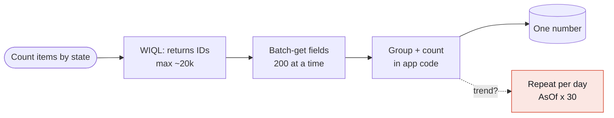
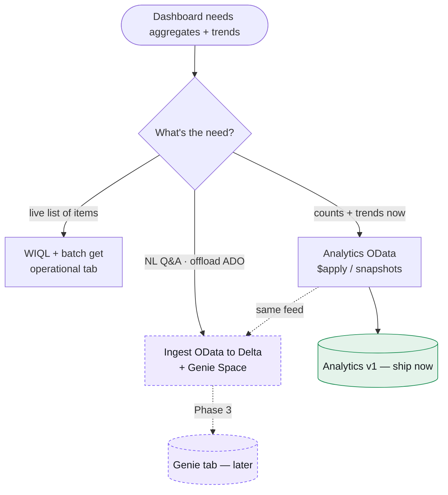

> Part 2 of the **ADO Companion** series. Part 1 covered building and shipping the app on Databricks. This one is about a single, deceptively deep question: **how do you actually pull the data behind a delivery-metrics dashboard?**

<!-- swap for real screenshot:  -->
<figure class="img-placeholder">
  <span>ADO Companion — the Overview analytics dashboard in light mode, showing four KPI cards with sparklines, a pipeline bar chart, a work-items-by-state donut, and a recent-items table</span>
</figure>

*The live dashboard. The **work-items-by-state donut** ("25 total") and the **"Open work items"** KPI (14) are **server-side OData aggregates** — `groupby((StateCategory), aggregate($count as Count))` — not a client-side count of fetched rows. The KPI's **sparkline** and its "25 total · 7d" caption come from a **`WorkItemSnapshot`** daily trend over the selected range.*

---

## TL;DR

A dashboard needs **aggregates and trends**, not a list of rows. There are three ways to get them out of Azure DevOps:

1. **WIQL + fetch-all + aggregate in our code** — what a naive first cut does. It works for tiny projects and current-state only, then falls over.
2. **The Analytics OData feed with `$apply`** — server-side `groupby`/`aggregate`/`filter`, plus **daily snapshots** for real history. **This is the one we chose.**
3. **Ingest OData → Delta → Genie** — the lakehouse play, needed for natural-language Q&A and to stop hammering ADO. Later, not first.

The punchline: **OData is the analytics source in all three cases.** You don't choose between OData and Delta — you start by calling OData directly from the backend, and pipe the *same feed* into Delta when you're ready for Genie. Sequence, don't choose.

---

## 1. The problem: a dashboard is not a list

The operational side of the app — the Work Items tab — wants a **list**: give me these 100 items with all their fields so I can render and edit them. That's a job for WIQL (the Work Item Query Language) plus a batch field fetch. It's the right tool there.

The analytics side wants the opposite: **don't give me the rows, give me the numbers.**

- *How many open items, by state?* (a donut)
- *How has "active" trended over the last 30 days?* (a sparkline / cumulative flow)
- *What's our weekly throughput?* (a bar series)

If you compute those by pulling every work item and counting in application code, you've turned a one-number question into a thousand-row transfer. That's the trap.

<!-- 📸 Screenshot slot: The work-items-by-state donut with its legend, zoomed in — the canonical "aggregate, not a list" widget. -->

---

## 2. Option 1 — WIQL + aggregate ourselves (the trap)

The shape of this approach:

1. Run a WIQL query → get back a list of work item **IDs** (capped at ~20,000).
2. Batch-fetch fields **200 IDs at a time**.
3. Group and count in code.

It works, and for a 50-item project you'd never notice the cost. But:

- **It doesn't scale.** Counting by state shouldn't require transferring every item's fields. You pay O(items) network for an O(states) answer.
- **It's page-bound.** Beyond the WIQL cap and the 200-per-call batch, you're paginating to count.
- **It can't do history.** WIQL describes items *as they are now*. To get "active count on each of the last 30 days," you'd issue a separate point-in-time (`AsOf`) query **per day** — 30 queries for one sparkline. That's not a trend engine; that's a workaround.

Keep WIQL for the live list. Don't make it your analytics layer.



<details class="diagram-note">
  <summary>Diagram description (text version)</summary>
  <p>A left-to-right flow showing a wasteful path. Start with a rounded node "Count items by state." Arrow right to a box "WIQL: returns IDs (max ~20k)." Arrow to "Batch-get fields, 200 at a time." Arrow to "Group + count in app code." Arrow to a small cylinder "One number." Then, from the "Group + count" box, a dashed branch labeled "trend?" drops down to a red box "Repeat per day — AsOf × 30." The visual story: a long chain of heavy steps to produce a single number, and an even worse dashed detour (in red) when you ask for a trend. Color the main chain neutral grey and the trend detour red to signal "anti-pattern."</p>
</details>

---

## 3. Option 2 — Analytics OData with `$apply` (the choice)

Azure DevOps ships a dedicated **Analytics** service with an **OData** endpoint built for exactly this. It does the aggregation **on the server** and returns the numbers.

Base URL (note the **different host**): `https://analytics.dev.azure.com/{org}/{project}/_odata/v4.0-preview/…` — same PAT auth as the REST API.

**Current state, by type and state — one call:**
```
WorkItems?$apply=groupby((WorkItemType,State),aggregate($count as Count))
```
Returns one row per (type, state) with a count. That's the donut and the "open items" KPI, exact and page-independent.

**Filter, then group:**
```
WorkItems?$apply=filter(State eq 'Active')/groupby((AssignedTo/UserName),aggregate($count as Count))
```

**Real trends via daily snapshots** — the part WIQL can't do:
```
WorkItemSnapshot?$apply=filter(DateValue ge 2026-06-01Z and DateValue le 2026-06-29Z)/groupby((DateValue,State),aggregate($count as Count))
```
The `WorkItemSnapshot` entity records each work item's values **once per day**, so this returns a count per day per state — precisely the series behind sparklines, week-over-week deltas, and cumulative-flow diagrams.

Why this is the right layer:
- **Aggregation is server-side.** One small response, not a row dump.
- **History is native.** Snapshots make trends a single query, not N day-queries.
- **It's the reporting surface Microsoft scales for.** Power BI's ADO connector uses the same feed.

<!-- 📸 Screenshot slot: A raw OData response (JSON) for the `groupby((State), aggregate($count as Count))` query — great for showing "the server already did the math." Optional but credible. -->

---

## 4. Option 3 — Ingest OData → Delta → Genie (the later play)

When do you graduate from "call OData live" to "copy it into the lakehouse"? When you want one of:

- **Natural-language Q&A** over the data (Databricks **Genie** answers questions over Delta tables in Unity Catalog).
- **To stop hammering ADO** (cache/rate-limit insulation), or join ADO data with other sources.
- **Heavy historical analysis** beyond what live OData comfortably serves.

The crucial detail: the **ingestion source is the same OData feed.** A scheduled job reads OData → writes Delta → a Genie Space sits on top. Nothing about Option 2 is wasted; Option 3 extends it.

---

## 5. The decision: sequence, don't choose



<details class="diagram-note">
  <summary>Diagram description (text version)</summary>
  <p>A top-down decision diagram. Start with a rounded node "Dashboard needs aggregates + trends." Arrow down to a diamond decision "What's the need?" Three labeled branches fan out: (1) "live list of items" → box "WIQL + batch get (operational tab)." (2) "counts + trends now" → box "Analytics OData ($apply / snapshots)." (3) "NL Q&A · offload ADO" → box "Ingest OData to Delta + Genie Space." From the OData box, a solid arrow points to a green rounded node "Analytics v1 — ship now." From the Delta/Genie box, a dashed arrow labeled "Phase 3" points to a purple, dashed node "Genie tab — later." Finally, a dashed arrow labeled "same feed" connects the OData box to the Delta/Genie box, emphasizing that the lakehouse path consumes the very same OData source. Color intent: green = build now, purple/dashed = planned. The message: pick OData for v1, and the Genie path later reuses the same feed — these are stages, not competing choices.</p>
</details>

---

## 6. How the queries map to the dashboard

| Widget | OData query (sketch) | Entity |
|---|---|---|
| "Open work items" KPI | `groupby((State),aggregate($count as Count))`, sum the non-closed | `WorkItems` |
| Work-items-by-state donut | `groupby((State),aggregate($count as Count))` | `WorkItems` |
| KPI sparklines / state trend | `filter(DateValue …)/groupby((DateValue,State),aggregate($count as Count))` | `WorkItemSnapshot` |
| Weekly throughput | completed-per-week via snapshot deltas or `CompletedDate` grouping | `WorkItems` / `WorkItemSnapshot` |
| Pipeline success / runs | Builds REST API (small) now; `PipelineRun` analytics entity later | REST / Analytics |

The time-range control (24h / 7d / 30d) becomes **real** here: it sets the `DateValue` window on the snapshot queries, so the numbers and sparklines actually change with the range — instead of being decorative.

<!-- 📸 Screenshot slot: The Overview header showing the 24h / 7d / 30d segmented control, with a note/caption that it now drives live OData snapshot windows. -->

---

## 7. The data-flow we're building

```mermaid
flowchart LR
  DASH[Overview dashboard<br/>React + TanStack Query] -->|/api/.../analytics?range=| BFF[FastAPI BFF<br/>Analytics client]
  BFF == "$apply aggregates<br/>+ snapshot trends" ==> ODATA[(ADO Analytics OData<br/>analytics.dev.azure.com)]
  ODATA ==> BFF
  BFF -. Phase 3 .-> JOB[Scheduled Job<br/>OData -> Delta]
  JOB -. .-> GENIE[(Delta + Genie Space)]
  DASH -. future NL Q&A .-> GENIE
  classDef live fill:#E7EEFC,stroke:#2D6CDF,color:#15191E;
  classDef plan fill:#EFEAFE,stroke:#7A5AF8,color:#15191E,stroke-dasharray:4 3;
  class ODATA live;
  class JOB,GENIE plan;
```

<details class="diagram-note">
  <summary>Diagram description (text version)</summary>
  <p>A left-to-right data-flow diagram. On the left, a box "Overview dashboard (React + TanStack Query)" with an arrow labeled "/api/.../analytics?range=" pointing right to a box "FastAPI BFF (Analytics client)." Between the BFF and a blue cylinder labeled "ADO Analytics OData — analytics.dev.azure.com," draw a bold double-headed/round-trip arrow labeled "$apply aggregates + snapshot trends" (request out, aggregated numbers back). Color that cylinder blue = the live path that exists now. Then, from the BFF, a dashed arrow labeled "Phase 3" points down/right to a box "Scheduled Job: OData → Delta," which has a dashed arrow to a purple cylinder "Delta + Genie Space." Finally a dashed arrow labeled "future NL Q&A" goes from the dashboard directly to the Genie cylinder. Visual intent: solid blue = today's live OData aggregation path; dashed purple = the planned lakehouse/Genie extension fed by the same OData source.</p>
</details>

<!-- swap for real screenshot:  -->
<figure class="img-placeholder">
  <span>The same dashboard with the time range set to 30d — the Open KPI caption now reads "25 total · 30d" and the sparkline shows the longer trend window</span>
</figure>

*The payoff: switching the range to **30d** refetches the OData snapshot window. The KPI caption becomes **"25 total · 30d"** and the sparkline redraws over the longer trend. The 24h / 7d / 30d control is now **real**, not decorative — it sets the `DateValue` window on the `WorkItemSnapshot` query.*

---

## 8. One gotcha worth flagging

The Analytics endpoint lives on a **different host** — `analytics.dev.azure.com` — not the `dev.azure.com` host the operational REST API uses. Same PAT, different base URL. So the backend gets a **separate, small Analytics client** alongside the existing REST client, rather than reusing the same base. Minor, but it'll bite you if you assume one host.

---

## 9. What shipped — and what's next

**Shipped (this post's screenshots are the real thing):**

- A BFF **Analytics client** that calls OData `$apply`: `count_by_state_category` (a `groupby((StateCategory))` count) and `open_trend` (a `WorkItemSnapshot` daily series over a date window).
- One endpoint, `GET /api/projects/{project}/analytics?range=24h|7d|30d`, returning `byCategory`, `open`, `total`, `trend`, and an `available` flag. It **degrades gracefully**: if a workspace doesn't have Analytics/snapshots enabled, it returns `available: false` and the dashboard falls back to a client-side rollup instead of breaking.
- The **Overview dashboard rewired** to those aggregates: the donut and "Open work items" KPI are now exact (not page-bound), and the **24h / 7d / 30d control is live** — it sets the snapshot date window, so the numbers and the sparkline actually change.

**Next (Phase 3):** the OData → Delta ingestion job and a **Genie Space** for natural-language questions over the same data — fed by the very feed this dashboard already queries.

The headline lesson for anyone building reporting on Azure DevOps: **don't aggregate work items yourself. Ask the Analytics service to do it — and treat that same feed as the on-ramp to your lakehouse.**

---

*Sources: Microsoft Learn — [Aggregate work tracking data with Analytics](https://learn.microsoft.com/en-us/azure/devops/report/extend-analytics/aggregated-data-analytics), [Query trend data with OData aggregation](https://learn.microsoft.com/en-us/azure/devops/report/extend-analytics/querying-for-trend-data), [OData Analytics query guidelines](https://learn.microsoft.com/en-us/azure/devops/report/extend-analytics/odata-query-guidelines).*
