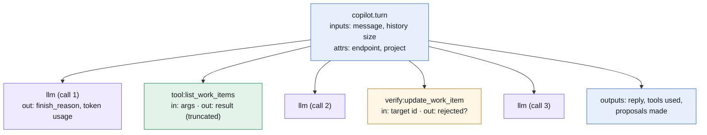
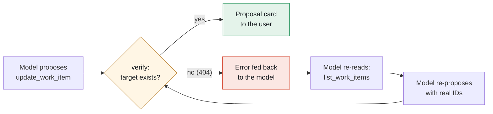

> Part 4 of the **ADO Companion** series. Part 3 gave the app a tool-calling agent with propose-then-apply write gating. This post is about the other half of trusting an agent in production: **observability**. We wired MLflow Tracing into the agent loop before the feature shipped — and it started paying for itself the same day.

<!-- 📸 Screenshot slot — HERO: The MLflow Traces tab for the `ado-companion-copilot` experiment: a list of `copilot.turn` traces, one expanded to show the nested `llm` and `tool:*` spans with timings. This is the post's thesis as a UI. -->

---

## TL;DR

Every copilot turn — question, model calls, tool executions, proposals — is logged as a **trace** in a Databricks-hosted MLflow experiment. The design fits in three sentences:

1. One user message = one `copilot.turn` trace, with child spans for every model call (`llm`), every tool execution (`tool:{name}`), and every write-target check (`verify:{name}`).
2. The experiment ID is a **per-workspace secret**; tracing is **optional and never fatal** — a misconfigured experiment degrades to "no traces," never to "no answers."
3. When something looks wrong in chat, you don't guess: **open the trace and read what the model actually saw and did.**

That third sentence is the whole business case. We had two odd behaviors in the first day of real usage, and both were diagnosed from traces in seconds — not by adding print statements and asking the user to reproduce.

---

## 1. The decision: tracing is part of the feature, not an add-on

Dashboards get away without deep instrumentation because their failure mode is visible — a wrong number on a screen. An agent's failure modes are *conversational*: it did something reasonable-looking for reasons you can't see. Which tools did it call? With what arguments? What came back? What did the context window contain by turn four?

Without answers, every user report starts a guessing game. So the rule we set before writing the loop: **no agent in the product without a flight recorder.**

Why MLflow specifically, when the runtime already lives on Databricks:

| Consideration | What MLflow Tracing gives us |
|---|---|
| **Zero new infrastructure** | Traces land in a workspace **experiment** — a resource that already exists, with its own ACLs. No collector, no vendor, no sidecar. |
| **The right shape** | Traces/spans map one-to-one onto an agent loop: turn → model calls → tool runs. We didn't have to invent a schema. |
| **Same-platform policy** | The runtime-AI rule from Part 1 (Databricks-native only) extends naturally to telemetry. Question data stays in the workspace. |
| **A UI we didn't build** | The experiment's Traces tab gives search, timing waterfalls, and input/output inspection for free. |

The dependency cost is one package: `mlflow-skinny` — the tracing-and-client subset, not the full server.

---

## 2. What a turn looks like

The span tree mirrors the loop's actual structure, so reading a trace *is* reading the turn:



<details class="diagram-note">
  <summary>Diagram description (text version)</summary>
  <p>A top-to-bottom tree diagram. The root node, in blue, is "copilot.turn" annotated with its inputs (the user message and history size) and attributes (endpoint name, project). From the root, five children hang in chronological order, left to right or stacked: a purple node "llm (call 1)" annotated "finish_reason, token usage"; a green node "tool:list_work_items" annotated "args in, truncated result out"; a purple node "llm (call 2)"; an amber node "verify:update_work_item" annotated "target id in, rejected? out"; a purple node "llm (call 3)." At the bottom, a blue summary node "outputs: reply, tools used, proposals made." Color code: blue = the turn envelope, purple = model calls, green = tool executions, amber = write-target verification. The message: one trace tells the complete story of one question.</p>
</details>

Three deliberate choices in what gets recorded:

- **Tool results are truncated** (500 chars in span outputs) — enough to see *what the model saw*, without turning the experiment into a data lake of work-item bodies.
- **The `verify:*` spans record rejections.** When the server refuses to surface a write proposal (more on why below), that decision is visible in the trace, not silent.
- **Token usage per `llm` span.** When the corporate workspace swaps in a pricier endpoint, the cost conversation starts from data, not vibes.

---

## 3. The implementation, and the rule that matters

The wiring is small enough to show almost completely. The experiment ID resolves like every other per-workspace config in this project — env var override, then secret:

```python
def _mlflow():
    """Return mlflow configured for our experiment, or None."""
    try:
        exp = resolve_experiment_id()          # env var, else ado/mlflow_experiment_id secret
        if not exp:
            return None
        import mlflow
        mlflow.set_tracking_uri("databricks")  # ambient auth: SP in prod, PAT in dev
        mlflow.set_experiment(experiment_id=exp)
        return mlflow
    except Exception:
        return None                            # tracing must never break a chat turn

def _span(name, **attrs):
    m = _mlflow()
    return m.start_span(name=name, attributes=attrs) if m else nullcontext(None)
```

The rule in that except clause deserves its own sentence: **tracing failures degrade to silence, never to errors.** A revoked grant, a deleted experiment, a network blip — none of them may cost a user their answer. This is the same graceful-degradation posture the whole app takes (Genie unconfigured? The tab says so. Store grants missing? Settings report unavailable) applied to telemetry.

Operationally, activation is two human steps in the workspace, both documented in the repo's agent runbook: create the experiment (one API call), set the secret, and grant the app's service principal `CAN_EDIT` on the experiment so it can log. Skip all of it and the copilot still works — untraced.

---

## 4. The payoff: two diagnoses at reading speed

Both of these happened in the first day of real usage. Neither required reproducing the issue, adding logging, or redeploying.

**The guessed ID.** A user asked the copilot to update *two* work items; the second proposal failed on Apply with a 404 from Azure DevOps. The trace showed the why immediately: the turn had **no `list_work_items` span** before the proposal. The model had assumed work item IDs are sequential and invented `#3` — which happened to be a deleted item sitting in the recycle bin. The fix became a design upgrade rather than a patch: the server now **verifies every update target exists before the proposal surfaces**, and a rejection is fed back to the model mid-loop so it corrects itself. Those checks are the amber `verify:*` spans — the incident is now a permanent, visible part of the loop's anatomy.

**The disappearing second proposal.** Same request class — "do this to two items" — but only one proposal card appeared, and the reply text contained a strange artifact. The trace showed the model's final message verbatim: the second tool call had been emitted **as plain text** (`update_work_item(id=2, ...)`) rather than as a structured tool call — a llama-family template quirk on multi-call turns. Prompt engineering alone didn't cure it; a small fallback parser now lifts text-form calls into real ones, so no proposal is ever silently dropped.

The pattern in both cases: **symptom in chat → open the trace → read the answer.** Ten seconds to diagnosis, because the instrumentation predated the incident. That's the argument for building the flight recorder before the first flight, and it's also the honest accounting: the agent misbehaved twice, the system caught both, and both fixes are now invariants with tests.

<!-- 📸 Screenshot slot: A single expanded trace showing a `verify:update_work_item` span with a rejection in its outputs — the guessed-ID class of bug, caught before the user ever saw a card. -->

---

## 5. Verification as a designed loop, not a patch

The guessed-ID incident produced what's now my favorite part of the architecture — a feedback loop *inside* the turn:



<details class="diagram-note">
  <summary>Diagram description (text version)</summary>
  <p>A left-to-right cycle diagram. A box "Model proposes update_work_item" flows into an amber diamond "verify: target exists?". The "yes" branch exits right to a green box "Proposal card to the user." The "no (404)" branch drops to a red box "Error fed back to the model," which flows into "Model re-reads: list_work_items," which flows into "Model re-proposes with real IDs," which loops back into the amber diamond. The message: bad proposals never reach the human; they bounce back to the model, which self-corrects within the same turn. Green = what the user sees, amber = the server's check, red = the internal correction path the user never sees.</p>
</details>

The user experiences none of this machinery — they just see correct proposals. The traces are where the machinery stays visible, which is exactly where you want it.

---

## 6. Lessons learned

- **Instrument before you ship, not after the first incident.** The entire value of both diagnoses was that the traces already existed.
- **Match the span tree to the loop's structure.** turn → llm → tool → verify means reading a trace requires no decoder ring.
- **Telemetry must be sacrificial.** Any trace-path failure degrades to "no trace." An observability feature that can take down the observed feature has negative value.
- **Config-as-secret extends to observability.** Experiment ID, like model endpoint, is a per-workspace value — the enterprise migration story stays "set three secrets."
- **Traces turn incidents into architecture.** Both early quirks ended their lives as permanent, tested invariants (`verify:*` spans, the text-form call parser) — visible in every future trace, not buried in a postmortem doc.

---

## 7. What's next

The experiment currently answers "what happened in this turn." The natural extensions: **evaluation runs** over recorded questions when we trial a new endpoint (the corporate `databricks-claude-sonnet-5` swap should be a measured decision, not a vibe), and **per-user session history** in the app-state store so conversations survive a browser refresh — with the trace ID stored alongside each turn, linking the product's history to the flight recorder's.

---

*The propose-then-apply gate from Part 3 makes the agent safe to let act; the traces make it safe to let evolve. You need both — a gate you can't audit is just a slower way to be surprised.*
