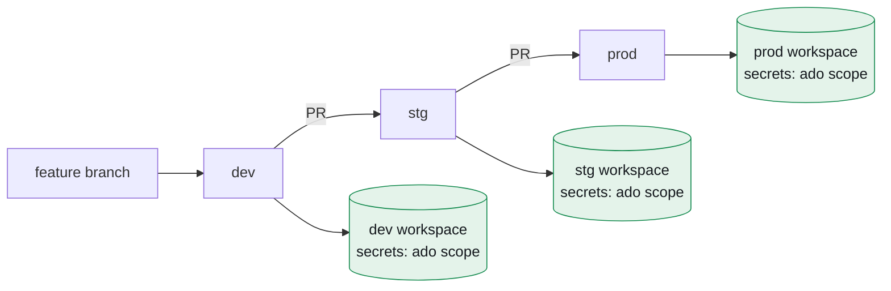
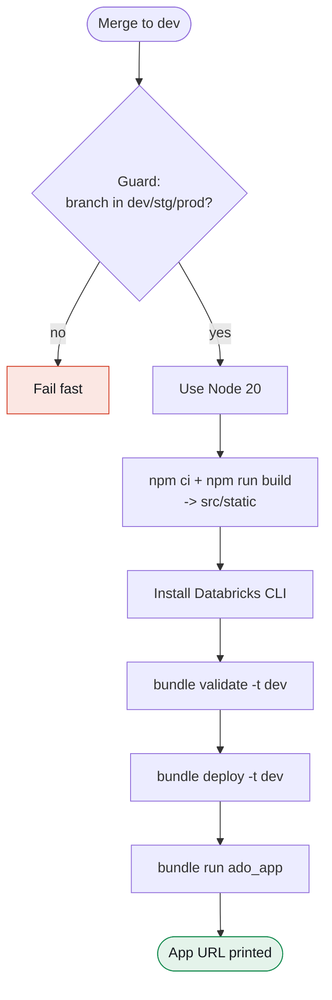

```mermaid
flowchart LR
  CC[Claude Code session] -->|git push| GH[GitHub repo<br/>feature branch]
  GH -->|GitHub Action<br/>mirror-to-ado| ADOR[Azure DevOps Repos<br/>same branch]
  ADOR -->|Pull Request| DEV[dev branch<br/>protected]
  DEV -->|trigger| PIPE[Azure Pipeline]
  PIPE -->|bundle deploy + run| APP[Databricks App<br/>running]

  classDef gh fill:#EEF1F4,stroke:#5B6770,color:#15191E;
  classDef ado fill:#E7EEFC,stroke:#2D6CDF,color:#15191E;
  classDef dbx fill:#FFF1EF,stroke:#FF3621,color:#15191E;
  class CC,GH gh;
  class ADOR,DEV,PIPE ado;
  class APP dbx;
```

A field report on turning the mobile Azure DevOps client into a web-first app hosted on Databricks, with an automated GitHub → Azure DevOps → Databricks delivery pipeline. Most of it came together in one pairing session with Claude Code. The interesting part wasn't the code — it was the seams between three platforms, and the five small bugs that live in those seams.

<figure class="img-placeholder">
  <span>HERO — Overview dashboard, light mode: KPI cards, pipeline bar chart, work-items donut, recent-items table</span>
</figure>

## TL;DR

I took the unofficial Azure DevOps mobile app as a starting point and rebuilt it for the browser — work items, pull requests, pipelines, and code — then pushed past it: a persistent app shell, a dashboard, dark mode, and write-back, so you can actually edit work items and approve or abandon PRs instead of just reading them.

The catch was where it had to live. Corporate policy allows Databricks but not external PaaS like Vercel, the source of truth had to be Azure DevOps Repos, and promotion had to follow protected branches (dev → stg → prod). So I built:

- A React (Vite + TypeScript) and FastAPI app, deployed as a single Databricks App.
- A Databricks Asset Bundle for declarative, multi-workspace deploys.
- An Azure Pipeline that builds and deploys on every merge, authenticating as a service principal.
- A GitHub → Azure DevOps mirror, so an AI coding agent could keep working on GitHub while ADO stayed the system of record.

And I hit five real bugs on the way to first deploy. They're all written up below — that's the part worth keeping.

## The idea

The reference point was a Flutter mobile client for Azure DevOps: log in, browse the board, review pull requests, watch pipelines, scan commits. Genuinely useful, but mobile-only and mostly read-only.

I wanted three things it didn't have:

1. **Web-first.** Reachable from any browser, and easy to embed later in Teams or wrap in a Mac shell.
2. **A workflow tool, not a viewer.** Edit work items, change state, comment, approve or abandon PRs — all written back to Azure DevOps through its REST API.
3. **Analytics.** A dashboard with delivery metrics, and eventually natural-language Q&A over the data through Databricks Genie.

## The constraints that shaped everything

Most architecture is just a response to constraints, and mine were specific:

| Constraint | Consequence |
|---|---|
| Hosting is Databricks only (no Vercel or external PaaS) | The app runs as a Databricks App. SSR buys nothing in that context, so a React SPA + FastAPI was the obvious fit. |
| Source of truth is Azure DevOps Repos | CI/CD is Azure Pipelines, and promotion is branch-based (dev/stg/prod). |
| Dev happens on a personal Databricks (Free Edition) | Free Edition is serverless-only, non-commercial, and apps stop after 24 hours — fine for prototyping, not production. Everything had to be config-swappable to a corporate workspace. |
| The AI agent develops on GitHub | I needed a bridge so GitHub work lands in ADO without manual syncing. |

The most consequential decision fell straight out of these: keep the operational plane separate from the analytical plane.

## Architecture: two data planes

The app does two genuinely different kinds of work, and the usual mistake is to conflate them.

The operational plane talks to the live Azure DevOps REST API — list work items, change a state, approve a PR. It's low-latency, it reads and writes, and it keeps no copy of ADO data.

The analytical plane runs over historical ADO data ingested into Delta tables in Unity Catalog — dashboards, and later Genie's natural-language questions. It's batch, read-only, and aggregate.

One FastAPI backend serves both, running inside the Databricks App. The point of the split is resilience: the operational plane never depends on Databricks SQL or Genie, so the app stays fully usable even when the analytics warehouse is asleep or rate-limited.


Solid blue is the live operational path that exists today; dashed purple is the analytical path that's still planned.

## The stack, and why

- **Frontend — React (Vite) SPA, TypeScript, Tailwind.** I picked it over Streamlit because I wanted a polished CRUD experience rather than a data-app look, and over Next.js because SSR and edge rendering are wasted inside a Databricks App.
- **Backend — FastAPI.** It gives me first-class access to the Databricks SDK for SQL, Genie, and Unity Catalog, and the same process doubles as the backend-for-frontend to the Azure DevOps REST API via `httpx`. One backend, two planes.
- **Data fetching — TanStack Query.** Caching, invalidation, and the optimistic-or-invalidate pattern that write-back needs.
- **Packaging — Databricks Asset Bundles.** A declarative `databricks.yml` with per-workspace targets, so going from dev to prod is a config switch, not a rewrite.

The frontend builds to static assets that FastAPI serves from the same process, which keeps the Databricks App a single deployable unit.

## Building it: phases 0–2

I worked in small, verifiable slices.

### Phase 0 — Foundation

A runnable skeleton that proved the spine end to end: React → FastAPI → Azure DevOps REST API, deployable to Databricks through the Asset Bundle. Auth was a Personal Access Token stored as a Databricks secret, with an org/project picker hitting `/api/projects`.

### Phase 1 — Read parity

Matching the mobile app: a tabbed per-project view with Work Items (a WIQL query plus a batch fetch), Pull Requests (with a status filter), Pipelines (recent build runs), and Code (repos and commits). Everything reads live from ADO through the BFF. I covered the response parsing with tests against a mocked HTTP transport, so none of that logic needs a live ADO connection to verify.

### Phase 2 — Write-back

This is the phase that turned it from a viewer into a tool:

- **Work items:** change state from an inline dropdown (a JSON-Patch `PATCH`), and add comments.
- **Pull requests:** approve via a reviewer vote, abandon, reactivate.

Every mutation goes through the FastAPI BFF and then invalidates the relevant TanStack Query, so the UI reflects the new state, with errors surfaced per row.

<figure class="img-placeholder">
  <span>Work Items table — editable state pills (colored dropdowns) with a comment composer open below</span>
</figure>

## The redesign: shell, dashboard, dark mode

The first cut was a single centered card. The redesign turned it into something that feels like a product:

- A persistent app shell — a left sidebar with the logo, project switcher, navigation with live counts, and a user footer; and a top bar with a breadcrumb, search, theme toggle, and connection status.
- A new Overview dashboard — four KPI cards with sparklines, a 14-run pipeline bar chart, a work-items-by-state donut, and a recent-items table. It's a client-side rollup of data the app already fetches, so v1 needed no new backend endpoint.
- Full dark mode — a CSS-variable token swap, persisted to `localStorage` and applied before first paint so there's no flash.

It's all driven by a design-token system, roughly 40 tokens with light and dark values wired into Tailwind, so a single switch flips the whole app and the theming stays consistent.

<figure class="img-placeholder">
  <span>DARK MODE — Overview dashboard, same view as the hero, in dark theme</span>
</figure>

<figure class="img-placeholder">
  <span>Pull Requests tab — Approve / Abandon buttons and status chips</span>
</figure>

## Multi-environment and branch-based promotion

Three workspaces, one per environment, promoted by protected git branches. The Asset Bundle models that with targets, and the key move is that every environment-specific value lives in per-workspace secrets rather than in files.

```yaml
# databricks.yml (excerpt)
targets:
  dev:  { mode: development }   # host resolved from the CLI/profile or pipeline vars
  stg:  { mode: production }
  prod: { mode: production }

resources:
  apps:
    ado_app:
      name: ado-companion
      source_code_path: ./src
      resources:
        - name: ado_org_url
          secret: { scope: ado, key: ado_org_url, permission: READ }
        - name: ado_pat
          secret: { scope: ado, key: ado_pat, permission: READ }
```

```yaml
# src/app.yaml — identical across all environments
env:
  - { name: ADO_ORG_URL, valueFrom: ado_org_url }
  - { name: ADO_PAT,     valueFrom: ado_pat }
```

Because the bundle and `app.yaml` are byte-for-byte identical across branches, promoting dev → stg → prod is a pure code merge. There are no config diffs to review and no way for a dev URL to leak into prod.



## CI/CD: Azure Pipelines and a service principal

The deploy pipeline triggers on a push to `dev`, `stg`, or `prod`. It derives the target environment from the branch name, builds the frontend, installs the Databricks CLI, validates, deploys, and starts the app. It authenticates as a service principal over OAuth machine-to-machine, so there's no human token sitting in CI.

```yaml
# azure-pipelines.yml (the deploy step, abridged)
- script: |
    databricks bundle validate -t "$(targetEnv)"
    databricks bundle deploy   -t "$(targetEnv)"
    databricks bundle run ado_app -t "$(targetEnv)"
  env:
    DATABRICKS_HOST: $(DATABRICKS_HOST)
    DATABRICKS_CLIENT_ID: $(DATABRICKS_CLIENT_ID)
    DATABRICKS_CLIENT_SECRET: $(DATABRICKS_CLIENT_SECRET)
```



The pipeline either dead-ends early on the wrong branch or marches straight through to a running app.

<figure class="img-placeholder">
  <span>Azure Pipelines run — a green successful run with the stage/step list expanded</span>
</figure>

## The integration problem: GitHub ↔ Azure DevOps

Here's a wrinkle that doesn't show up in a tidy architecture diagram. The AI coding agent worked against a GitHub repository, but the system of record was Azure DevOps Repos. Manually syncing the two on every change is exactly the kind of toil you want to design away.

The fix was a GitHub Action that mirrors every push to Azure DevOps — but only feature branches, never the protected ones. The agent keeps pushing to GitHub, the branch shows up in ADO automatically, and you still open a PR into a protected branch inside ADO, which preserves the gates and the deploy pipeline.

```yaml
# .github/workflows/mirror-to-ado.yml (the push, abridged)
git push --force "https://pat:${PAT}@${ADO_REPO_HOST_AND_PATH}" \
  "HEAD:refs/heads/${BRANCH}"
```



An AI agent pushes to GitHub, a mirror lands it in ADO, a PR into a protected branch fires the pipeline, and the pipeline deploys to Databricks — one assembly line across three platforms.

<figure class="img-placeholder">
  <span>GitHub Actions tab — a green "Mirror to Azure DevOps" run, and/or the ADO Branches view showing the mirrored branch</span>
</figure>

## War stories: five bugs on the road to first deploy

The architecture is the easy part to write up. The debugging is what actually happened, and it's the most useful thing to pass on. In order:

### Bug 1 — The secret reference that wasn't a path

My first instinct for wiring the ADO token into the app was `valueFrom: "ado/ado_pat"` in `app.yaml`. Wrong: in Databricks Apps, `valueFrom` references a named resource declared in the bundle, not a `scope/key` string. The fix was to declare a `secret` resource in `databricks.yml` and reference it by name (`valueFrom: ado_pat`). The lesson is to read the IaC schema instead of pattern-matching from some other tool.

### Bug 2 — The mirror that asked for a username

The first mirror used a Git `http.extraheader` to inject auth. In CI that fell back to an interactive prompt and died with `could not read Username for 'https://dev.azure.com'`. Switching to a PAT-in-URL (`https://pat:<token>@dev.azure.com/...`) and setting `GIT_TERMINAL_PROMPT=0` made auth deterministic and made failures loud instead of hanging.

### Bug 3 — The newline in the pasted secret

Next failure: `url contains a newline in its password component`. The PAT had been pasted into the GitHub secret with a trailing newline — a nearly invisible copy/paste artifact. Rather than count on a clean paste every time, I sanitize the secret in the workflow with `tr -d '[:space:]'`. Never trust that a secret is whitespace-clean.

### Bug 4 — "Variable group was not found or is not authorized"

The pipeline hard-referenced an Azure DevOps variable group (`- group: databricks-dev`), but the credentials had actually been stored as pipeline variables — two different mechanisms. I dropped the required group reference so the pipeline reads from pipeline variables, and documented variable groups as the upgrade path once there are multiple workspaces. Match the YAML to how the operator actually stored the config.

### Bug 5 — `409 ALREADY_EXISTS: app ado-companion already exists`

The pipeline authenticated, validated, uploaded, and then hit a wall creating the app: it already existed. An earlier manual deploy, run as a human user, had created `ado-companion`. The service principal's bundle had no record of that, so it tried to create rather than update. The fix was to delete the orphaned app, let the service principal create and own it, and from then on deploy only through the pipeline so there's a single owner. Pick one identity to own a resource — mixing a human and a service principal guarantees a collision.

<figure class="img-placeholder">
  <span>THE PAYOFF — the deployed app on its Databricks Apps URL, showing real Azure DevOps data</span>
</figure>

## Lessons learned

- **Name your constraints before your tools.** "Databricks-only host" and "ADO is the source of truth" decided the entire stack and CI design.
- **Separate the planes.** Keeping the live operational path independent of the analytical one means the core app degrades gracefully and stays simple.
- **Config in secrets, code identical across environments.** It makes branch-based promotion a pure merge — the cleanest multi-environment story I know.
- **One owner per resource.** That 409 was entirely about a human and a service principal both trying to own the same app.
- **Automate the boring bridge.** The GitHub → ADO mirror removed a recurring manual sync and let the AI agent and the corporate process coexist.
- **The bugs are the content.** Every failure above is something the next person will hit, so writing them down is the highest-leverage part of the whole exercise.

## What's next

The operational app is real today. The analytical plane is the next build:

1. A scheduled OData → Delta ingestion job to land ADO history in Unity Catalog.
2. A Genie Space over those tables.
3. An in-app natural-language Q&A panel calling the Genie Conversation API, plus real week-over-week trend deltas behind the dashboard's time-range control.

After that, the surface variants: a Microsoft Teams tab (same codebase, Entra SSO) and a Tauri Mac shell, both wrapping the one web app.

## Appendix — repository layout

```
ado/
├─ databricks.yml            # Asset Bundle: dev/stg/prod targets + app + secret resources
├─ azure-pipelines.yml       # Deploy pipeline (build -> bundle deploy + run)
├─ azure-pipelines-validate.yml  # PR gate: build + tests + bundle validate
├─ .github/workflows/
│  └─ mirror-to-ado.yml      # GitHub -> Azure DevOps mirror
├─ src/                      # the Databricks App (deployed)
│  ├─ app.yaml               # entrypoint + env via secret valueFrom
│  ├─ app/                   # FastAPI BFF: ADO client + /api routes
│  └─ static/                # built React app (served by FastAPI)
└─ frontend/                 # React (Vite + TS + Tailwind) source
```

---

*Built in a single pairing session with Claude Code. The hard parts weren't the code — they were the seams between GitHub, Azure DevOps, and Databricks, and the five small bugs that live in those seams.*
