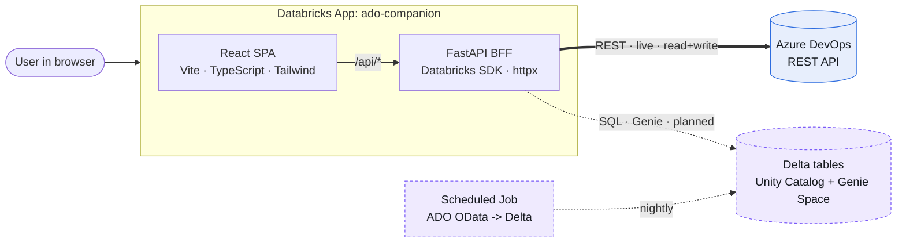
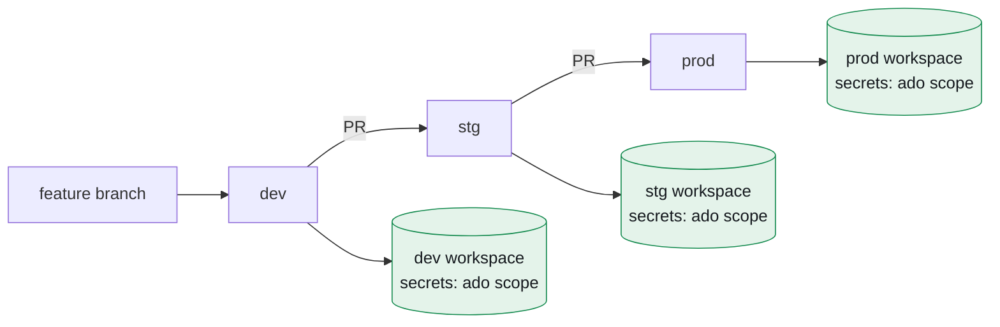

```mermaid
flowchart LR
  CC[Claude Code session] -->|git push| GH[GitHub repo<br/>feature branch]
  GH -->|GitHub Action<br/>mirror-to-ado| ADOR[Azure DevOps Repos<br/>same branch]
  ADOR -->|Pull Request| DEV[dev branch<br/>protected]
  DEV -->|trigger| PIPE[Azure Pipeline]
  PIPE -->|bundle deploy + run| APP[Databricks App<br/>running]

  classDef gh fill:#EEF1F4,stroke:#5B6770,color:#15191E;
  classDef ado fill:#E7EEFC,stroke:#2D6CDF,color:#15191E;
  classDef dbx fill:#FFF1EF,stroke:#FF3621,color:#15191E;
  class CC,GH gh;
  class ADOR,DEV,PIPE ado;
  class APP dbx;
```

> A field report on turning a mobile Azure DevOps client into a **web-first app hosted on Databricks**, with a fully automated GitHub → Azure DevOps → Databricks delivery pipeline — built in a single pairing session with Claude Code.

<!-- 📸 Screenshot slot — HERO: The Overview dashboard in light mode (the four KPI cards, the pipeline bar chart, the donut, and the recent-items table). This is the money shot; put it right under the title. -->

---

## TL;DR

We took the unofficial **Azure DevOps mobile app** as inspiration and rebuilt it as a **web app** — work items, pull requests, pipelines, and code — then went further: a persistent app shell, a dashboard, dark mode, and **write-back** (edit work items, approve/abandon PRs) instead of read-only.

The twist: it had to run **on Databricks Apps** (corporate policy allows Databricks, not external PaaS like Vercel), and the source of truth had to live in **Azure DevOps Repos** with a **branch-based promotion** model (dev → stg → prod). We built:

- A **React (Vite + TypeScript) + FastAPI (Python)** app, deployed as a single Databricks App.
- A **Databricks Asset Bundle** for declarative, multi-workspace deploys.
- An **Azure Pipeline** that builds and deploys on every merge, authenticating with a **service principal**.
- A **GitHub → Azure DevOps mirror** so an AI coding agent could keep working on GitHub while ADO remained the system of record.

And we hit five real bugs getting to first deploy. They're all documented below — that's the useful part.

---

## 1. The idea

The reference was a Flutter mobile client for Azure DevOps: log in, browse work items on the board, review pull requests, watch pipelines, scan commits. Useful, but mobile-only and read-mostly.

We wanted three things it didn't have:

1. **Web-first.** Accessible from any browser, embeddable later in Teams or a Mac shell.
2. **A real workflow tool.** Not just *view* work items — **edit** them. Change state, comment, approve/abandon PRs, all written back to Azure DevOps through its REST API.
3. **Analytics.** A dashboard with delivery metrics, and (eventually) natural-language Q&A over the data via **Databricks Genie**.

<!-- 📸 Screenshot slot: Side-by-side or before/after — the original mobile app concept vs. our web Overview. (Optional, if you have a reference image.) -->

---

## 2. The constraints that shaped everything

Good architecture is mostly a response to constraints. Ours were unusually specific:

| Constraint | Consequence |
|---|---|
| **Hosting: Databricks only** (no Vercel/external PaaS) | The app runs *as a Databricks App*. Next.js/SSR buys nothing here — we chose a React SPA + FastAPI. |
| **Source of truth: Azure DevOps Repos** | CI/CD is **Azure Pipelines**, and promotion is branch-based (dev/stg/prod). |
| **Dev on a personal Databricks (Free Edition)** | Free Edition is serverless-only, non-commercial, and apps stop after 24h — fine for prototyping, not production. Everything had to be **config-swappable** to a corporate workspace. |
| **AI agent develops on GitHub** | We needed a bridge so GitHub work lands in ADO without manual syncing. |

The single most important design decision fell out of these: **separate the operational plane from the analytical plane.**

---

## 3. Architecture: two data planes

The app does two fundamentally different kinds of work, and conflating them is the classic mistake.

- The **operational plane** talks to the **live Azure DevOps REST API**: list work items, change a state, approve a PR. Low-latency, read **and** write. No copy of ADO data is stored.
- The **analytical plane** runs over **historical ADO data ingested into Delta tables** in Unity Catalog: dashboards and (later) Genie natural-language questions. Batch, read-only, aggregate.

Both are served by **one FastAPI backend** running inside the Databricks App. Crucially, the operational plane never depends on Databricks SQL or Genie — so the app stays fully usable even when the analytics warehouse is asleep or rate-limited.



<details class="diagram-note">
  <summary>Diagram description (text version)</summary>
  <p>A left-to-right architecture diagram. On the far left, a rounded "User in browser" node with an arrow pointing right into a large container box labeled "Databricks App: ado-companion." Inside that container, stacked vertically, are two boxes: "React SPA (Vite · TypeScript · Tailwind)" on top and "FastAPI BFF (Databricks SDK · httpx)" below it, connected by a short downward arrow labeled "/api/\*". From the FastAPI box, a bold solid arrow points right to a cylinder (database) labeled "Azure DevOps REST API," and that arrow is labeled "REST · live · read+write" (color it blue to mean the operational plane). Also from the FastAPI box, a dashed arrow points to a second cylinder labeled "Delta tables — Unity Catalog + Genie Space," labeled "SQL · Genie · planned" (color it purple, dashed, to mean future/analytical). A separate box on the bottom labeled "Scheduled Job: ADO OData → Delta" has a dashed arrow labeled "nightly" feeding the same Delta cylinder. Visual intent: solid blue = live operational path that exists today; dashed purple = analytical path that is planned.</p>
</details>

<!-- 📸 Screenshot slot: Optional — a Databricks workspace view showing the `ado-companion` app resource, to ground "it really runs here." -->

---

## 4. The stack, and why

- **Frontend — React (Vite) SPA + TypeScript + Tailwind.** Chosen over Streamlit (we wanted a polished CRUD UX, not a data-app look) and over Next.js (SSR/edge is wasted inside a Databricks App).
- **Backend — FastAPI (Python).** First-class **Databricks SDK** for SQL/Genie/Unity Catalog, and the same process acts as the **BFF** (backend-for-frontend) to the Azure DevOps REST API via `httpx`. One backend, two planes.
- **Data fetching — TanStack Query.** Caching, invalidation, and the optimistic-or-invalidate pattern for write-back.
- **Packaging — Databricks Asset Bundles.** Declarative `databricks.yml` with per-workspace targets, so dev → prod is a config switch, not a rewrite.

The frontend is built to static assets and **served by FastAPI from the same process** — so the Databricks App is a single deployable unit.

---

## 5. Building it: Phases 0–2

We built in deliberately small, verifiable slices.

### Phase 0 — Foundation
A runnable skeleton proving the spine end-to-end: **React → FastAPI → Azure DevOps REST API**, deployable to Databricks via the Asset Bundle. Auth via a Personal Access Token stored as a Databricks secret; an org/project picker calling `/api/projects`.

### Phase 1 — Read parity
Match the mobile app: a tabbed per-project view with **Work Items** (WIQL query + batch fetch), **Pull Requests** (with a status filter), **Pipelines** (recent build runs), and **Code** (repos + commits). All read live from ADO through the BFF. Response parsing was covered by tests using a mocked HTTP transport — no live ADO needed to verify the logic.

### Phase 2 — Write-back (the part that makes it a *tool*)
This is where it stopped being a viewer:

- **Work items:** change state via an inline dropdown (JSON-Patch `PATCH`), add comments.
- **Pull requests:** approve (reviewer vote), abandon, reactivate.

Every mutation goes through the FastAPI BFF, then invalidates the relevant TanStack Query so the UI reflects the new truth, with per-row error surfacing.

<!-- 📸 Screenshot slot: The Work Items table showing the editable state pills (the colored dropdowns) and a comment composer open below the table. -->

---

## 6. The redesign: shell, dashboard, dark mode

The first cut was a centered single card. The redesign turned it into a product:

- A **persistent app shell** — left sidebar (logo, project switcher, navigation with live counts, user footer) and a top bar (breadcrumb, search, theme toggle, connection status).
- A new **Overview dashboard** — four KPI cards with sparklines, a 14-run pipeline bar chart, a work-items-by-state donut, and a recent-items table. (Built as a **client-side rollup** from data we already fetch — no new backend endpoint required for v1.)
- **Full dark mode** — implemented as a CSS-variable token swap, persisted to `localStorage`, applied before first paint to avoid a flash.

Everything is driven by a **design-token system** (light/dark values for ~40 tokens) wired into Tailwind, so theming is consistent and a single switch flips the whole app.

<!-- 📸 Screenshot slot — DARK MODE: The Overview dashboard in dark mode (same view as the hero, dark). Pair it visually with the hero to show the theme switch. -->

<!-- 📸 Screenshot slot: The Pull Requests tab with the Approve / Abandon action buttons and status chips. -->

---

## 7. Multi-environment and branch-based promotion

Three workspaces (dev, stg, prod), one per environment, promoted by **protected git branches**. The Asset Bundle models this with **targets**, and — this is the key move — **all environment-specific configuration lives in per-workspace secrets**, not in files.

```yaml
# databricks.yml (excerpt)
targets:
  dev:  { mode: development }   # host resolved from the CLI/profile or pipeline vars
  stg:  { mode: production }
  prod: { mode: production }

resources:
  apps:
    ado_app:
      name: ado-companion
      source_code_path: ./src
      resources:
        - name: ado_org_url
          secret: { scope: ado, key: ado_org_url, permission: READ }
        - name: ado_pat
          secret: { scope: ado, key: ado_pat, permission: READ }
```

```yaml
# src/app.yaml — identical across all environments
env:
  - { name: ADO_ORG_URL, valueFrom: ado_org_url }
  - { name: ADO_PAT,     valueFrom: ado_pat }
```

Because the bundle and `app.yaml` are **byte-for-byte identical across branches**, promoting `dev → stg → prod` is a **pure code merge** — no config diffs, no risk of a dev URL leaking into prod.



<details class="diagram-note">
  <summary>Diagram description (text version)</summary>
  <p>A left-to-right promotion diagram. A box labeled "feature branch" flows right into a box "dev," which flows via an arrow labeled "PR" into "stg," which flows via another "PR" arrow into "prod." These three (dev, stg, prod) sit in a horizontal row, like a pipeline. Below each of the three branch boxes, a downward arrow points to a green cylinder (database/workspace) labeled respectively "dev workspace," "stg workspace," and "prod workspace," each annotated "secrets: ado scope." The message: the same code marches left-to-right through protected branches; each branch deploys to its own workspace, and the only thing that differs between environments is the per-workspace secret values. Use a calm green for the workspace cylinders.</p>
</details>

---

## 8. CI/CD: Azure Pipelines + a service principal

The deploy pipeline triggers on a push to `dev`/`stg`/`prod`, derives the target environment from the branch name, builds the frontend, installs the Databricks CLI, validates, deploys, and starts the app. It authenticates to Databricks as a **service principal** (OAuth machine-to-machine), so no human token is in CI.

```yaml
# azure-pipelines.yml (the deploy step, abridged)
- script: |
    databricks bundle validate -t "$(targetEnv)"
    databricks bundle deploy   -t "$(targetEnv)"
    databricks bundle run ado_app -t "$(targetEnv)"
  env:
    DATABRICKS_HOST: $(DATABRICKS_HOST)
    DATABRICKS_CLIENT_ID: $(DATABRICKS_CLIENT_ID)
    DATABRICKS_CLIENT_SECRET: $(DATABRICKS_CLIENT_SECRET)
```


<details class="diagram-note">
  <summary>Diagram description (text version)</summary>
  <p>A top-to-bottom flowchart of a CI/CD pipeline. Start with a rounded terminator node "Merge to dev." Arrow down into a diamond decision node: "Guard: is the branch dev/stg/prod?" From the diamond, a branch labeled "no" goes to a red box "Fail fast" (a dead end). The "yes" branch continues downward through a vertical sequence of rectangular steps: "Use Node 20" → "npm ci + npm run build → src/static" → "Install Databricks CLI" → "bundle validate -t dev" → "bundle deploy -t dev" → "bundle run ado_app." The final arrow lands on a green rounded terminator "App URL printed." Color the success terminator green and the fail-fast box red; keep the middle steps neutral/grey. The intent: a guarded, linear deploy that either dead-ends early on a wrong branch or marches straight to a running app.</p>
</details>

<!-- 📸 Screenshot slot: The Azure Pipelines run view — a green successful run with the stage/step list expanded. -->

---

## 9. The integration problem: GitHub ↔ Azure DevOps

Here's a wrinkle that doesn't show up in tidy architecture diagrams. The AI coding agent (Claude Code) worked against a **GitHub** repository, but the system of record was **Azure DevOps Repos**. Manually syncing the two on every change is exactly the toil you don't want.

The fix: a **GitHub Action that mirrors every push to Azure DevOps** — but *only* feature branches, never the protected `dev`/`stg`/`prod`. So the agent keeps pushing to GitHub; the branch lands in ADO automatically; and you still open a PR into a protected branch *inside ADO*, preserving the gates and the deploy pipeline.

```yaml
# .github/workflows/mirror-to-ado.yml (the push, abridged)
git push --force "https://pat:${PAT}@${ADO_REPO_HOST_AND_PATH}" \
  "HEAD:refs/heads/${BRANCH}"
```



<details class="diagram-note">
  <summary>Diagram description (text version)</summary>
  <p>A left-to-right pipeline diagram showing how code travels from an AI agent to a running app, crossing three "worlds" (GitHub, Azure DevOps, Databricks). Far left: a box "Claude Code session" with an arrow labeled "git push" to a box "GitHub repo (feature branch)." From there, an arrow labeled "GitHub Action: mirror-to-ado" points to "Azure DevOps Repos (same branch)." From there, an arrow labeled "Pull Request" points to "dev branch (protected)." From dev, an arrow labeled "trigger" points to "Azure Pipeline." Finally an arrow labeled "bundle deploy + run" points to "Databricks App (running)." Color-group the nodes: the two leftmost (Claude Code, GitHub) in neutral grey = "GitHub world"; the middle three (ADO Repos, dev branch, Azure Pipeline) in blue = "Azure DevOps world"; the final node (Databricks App) in Databricks-lava red/orange = "Databricks world." The message: an AI agent pushes to GitHub, a mirror lands it in ADO automatically, a PR into a protected branch fires the pipeline, and the pipeline deploys to Databricks — a clean assembly line across three platforms.</p>
</details>

<!-- 📸 Screenshot slot: The GitHub Actions tab showing a green "Mirror to Azure DevOps" run; and/or the Azure DevOps Repos → Branches view showing the mirrored branch. -->

---

## 10. War stories: five bugs on the road to first deploy

The architecture is the easy part to write up. The **debugging** is what actually happened — and it's the most useful thing to share. In order:

### Bug 1 — The secret reference that wasn't a path
First instinct for wiring the ADO token into the app was `valueFrom: "ado/ado_pat"` in `app.yaml`. Wrong: Databricks Apps' `valueFrom` references a **named resource** declared in the bundle, not a `scope/key` string. The fix was to declare a `secret` resource in `databricks.yml` and reference it by name (`valueFrom: ado_pat`). Lesson: **read the IaC schema; don't pattern-match from other tools.**

### Bug 2 — The mirror that asked for a username
The first mirror used a Git `http.extraheader` to inject auth. In CI it fell back to an interactive prompt and died with `could not read Username for 'https://dev.azure.com'`. Switching to **PAT-in-URL** (`https://pat:<token>@dev.azure.com/...`) and setting `GIT_TERMINAL_PROMPT=0` made auth deterministic and failures loud.

### Bug 3 — The newline in the pasted secret
Next failure: `url contains a newline in its password component`. The PAT had been pasted into the GitHub secret **with a trailing newline** — a near-invisible copy/paste artifact. Rather than rely on a perfect paste, we **sanitize the secret in the workflow** (`tr -d '[:space:]'`). Lesson: **never trust that a secret is whitespace-clean.**

### Bug 4 — "Variable group was not found or is not authorized"
The pipeline hard-referenced an Azure DevOps **variable group** (`- group: databricks-dev`), but the credentials had been set as **pipeline variables** instead. Two different mechanisms. We dropped the required group reference so the pipeline reads from pipeline variables, and documented variable groups as the multi-workspace upgrade path. Lesson: **match the YAML to how the operator actually stored the config.**

### Bug 5 — `409 ALREADY_EXISTS: app ado-companion already exists`
The pipeline authenticated, validated, uploaded, and then hit a wall **creating the app**: it already existed. Why? An **earlier manual deploy** (run as a *human user*) had created `ado-companion`. Now the **service principal**'s bundle had no record of it, so it tried to *create* rather than *update*. The fix: delete the orphaned app and let the SP create and own it — then deploy **only through the pipeline** thereafter, so there's a single owner. Lesson: **pick one identity to own a resource; mixing a human and an SP guarantees a collision.**

<!-- 📸 Screenshot slot: Optional but great for credibility — the actual pipeline log showing the `409 ALREADY_EXISTS` error, then a follow-up screenshot of the green run after the fix. -->

<!-- 📸 Screenshot slot — THE PAYOFF: The deployed app running on its Databricks Apps URL, showing real Azure DevOps data. -->

---

## 11. Lessons learned

- **Constraints first.** "Databricks-only host" and "ADO is the source of truth" decided the entire stack and CI design. Name your constraints before you name your tools.
- **Separate planes.** Keeping the live operational path independent of the analytical path means the core app degrades gracefully and stays simple.
- **Config in secrets, code identical across envs.** This makes branch-based promotion a pure merge — the cleanest multi-environment story we know.
- **One owner per resource.** The 409 was entirely about a human and a service principal both trying to own the same app.
- **Automate the boring bridge.** The GitHub→ADO mirror removed a recurring manual sync and let the AI agent and the corporate process coexist.
- **The bugs are the content.** Every failure above is a thing the next person will hit. Writing them down is the highest-leverage part of the post.

---

## 12. What's next

The operational app is real today. The **analytical plane** is the next build:

1. A scheduled **OData → Delta** ingestion job to land ADO history in Unity Catalog.
2. A **Genie Space** over those tables.
3. An in-app **natural-language Q&A** panel calling the **Genie Conversation API**, plus real week-over-week trend deltas behind the dashboard's time-range control.

After that: surface variants — a **Microsoft Teams tab** (same codebase, Entra SSO) and a **Tauri Mac shell** — all wrapping the one web app.

<!-- 📸 Screenshot slot: Optional teaser — a mock of the planned Genie/Analytics tab, if you want to end on a forward-looking note. -->

---

## Appendix — repository layout

```
ado/
├─ databricks.yml            # Asset Bundle: dev/stg/prod targets + app + secret resources
├─ azure-pipelines.yml       # Deploy pipeline (build -> bundle deploy + run)
├─ azure-pipelines-validate.yml  # PR gate: build + tests + bundle validate
├─ .github/workflows/
│  └─ mirror-to-ado.yml      # GitHub -> Azure DevOps mirror
├─ src/                      # the Databricks App (deployed)
│  ├─ app.yaml               # entrypoint + env via secret valueFrom
│  ├─ app/                   # FastAPI BFF: ADO client + /api routes
│  └─ static/                # built React app (served by FastAPI)
└─ frontend/                 # React (Vite + TS + Tailwind) source
```

---

*Built in a single pairing session with Claude Code. The hard parts weren't the code — they were the seams between GitHub, Azure DevOps, and Databricks, and the five small bugs that live in those seams.*
