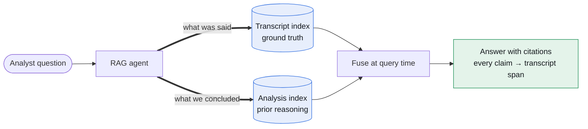

Customer-service calls are one of the richest, least-used datasets a company has. The recordings exist; almost nothing reads them at scale. I built a lakehouse pipeline that ingests, transcribes, analyzes and semantically searches those calls — and a RAG agent on top that answers investigative questions *with citations*, so an analyst can trust the answer enough to act on it.

---

## TL;DR

- **A medallion layout keeps an AI pipeline debuggable.** Transcription, analysis, and embeddings are each a tracked step — when a transcript looks wrong, you walk back one layer, not one opaque job.
- **Two indexes, not one.** A transcript index answers "what was said"; an analysis index answers "what did we already conclude." The agent retrieves against both and fuses at query time.
- **Citations are the contract.** Every claim points to a transcript span it can be checked against — and an MLflow eval stack (schema checks, LLM-as-judge, A/B) turns prompt changes into defensible numbers.

---

## Medallion, end to end

The backbone is a standard Bronze/Silver/Gold layout, which matters more than it sounds — it's what keeps a messy, multi-step AI pipeline debuggable.

  

Bronze

raw recordings + call metadata, landed untouched

  
↓

  

Silver

transcription → LLM analysis → embeddings, each a tracked step

  
↓

  

Gold + RAG

governed serving tables + dual-index retrieval for cited answers

Because every transformation is its own layer, when a transcript looks wrong I can walk back exactly one step at a time instead of re-running an opaque end-to-end job.

---

## Why two indexes

A single vector index over transcripts answers "what was said." But investigators also ask "what did we already conclude?" — questions better served by the prior LLM analyses. So the agent retrieves against both: a transcript index for ground truth, and an analysis index for prior reasoning. The two are fused at query time.

  
Diagram description (text version)

  
A left-to-right retrieval diagram. An "Analyst question" node flows into a "RAG agent" box. From the agent, two bold arrows fan out to two blue cylinders: a "Transcript index — ground truth" (labeled "what was said") and an "Analysis index — prior reasoning" (labeled "what we concluded"). Both cylinders feed a "Fuse at query time" box, which flows into a green "Answer with citations" node annotated "every claim → transcript span". The message: one question, two retrieval planes, one cited answer.

> A citation isn't decoration. It's the contract: every claim the agent makes points back to a specific transcript span it can be checked against.

Grounding with citations is what makes this usable for high-trust work. The agent doesn't get to assert; it gets to quote. If it can't find support, that's a visible gap rather than a confident hallucination.

---

## Measuring it like a pipeline

None of this ships without evaluation. I run an MLflow-based framework with three layers:

| Layer | Question it answers | Failure it catches |
|---|---|---|
| Deterministic schema checks | Did the output even conform? | Malformed or incomplete responses |
| LLM-as-judge scoring | Is the answer good? | Quality drift, weak grounding |
| A/B across prompts and models | Is the new version *better*? | "Feels better" shipping on vibes |

That turns "the new prompt feels better" into a number I can defend — and the prompts themselves come from the [control plane](/blog/prompt-control-plane), so every eval run is tied to an exact version.

The result is a system that reads thousands of calls nobody had time to listen to, and answers questions about them in a way you can actually audit. That combination — scale plus trust — is the whole point.

---

*The prompts behind every step here are versioned rows in [the prompt control plane](/blog/prompt-control-plane) — same lakehouse, same governance, one audit trail from wording to answer.*
