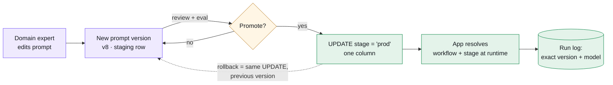

When you run GenAI in an enterprise, the bottleneck stops being the model and starts being the *process*. A new workflow shouldn't require a release. So at Horizon I built a prompt control plane: every prompt, model binding, and routing rule lives in a database table, and shipping a new LLM workflow is a data change — not a code change.

---

## TL;DR

- **Prompts change on a different rhythm than code** — domain experts want to iterate Tuesday afternoon, not at the next deploy window. Putting prompts in git makes engineers the reviewers of wording they aren't qualified to review.
- **The control plane is a table.** A workflow row points at a versioned prompt, a model, and a stage. Promotion to production is a one-column update; rollback is the same update in reverse.
- **Audit comes for free.** Every run resolves and logs its exact prompt version and model, so "which prompt produced this output, months ago?" is a query, not an archaeology project.

---

## The problem with prompts in code

Prompts feel like code, so the instinct is to commit them. But prompts change on a completely different rhythm. A subject-matter expert wants to tweak the wording of an analysis instruction on Tuesday; waiting for a deploy window to do that is absurd, and it pushes prompt edits onto engineers who aren't the right reviewers anyway.

The deeper issue is auditability. In a regulated environment you need to answer "which exact prompt and model produced this output, on this date?" — months later. Git can technically answer that, but only if every run records the commit SHA, and nobody does that reliably.

> Treat prompts as governed data, not as source code. Then versioning, promotion, and audit come for free from the database you already trust.

---

## The control plane, concretely

The lifecycle of a prompt, end to end:

  
Diagram description (text version)

  
A left-to-right lifecycle diagram. A "Domain expert edits prompt" box flows into a "New prompt version — v8, staging row" box. An arrow labeled "review + eval" leads to a "Promote?" decision diamond. The "yes" branch goes to "UPDATE stage = 'prod' — one column", then to "App resolves workflow + stage at runtime", ending at a cylinder "Run log: exact version + model". The "no" branch loops back to the staging version, and a dashed arrow from the promote step back to the version box notes that rollback is the same UPDATE pointing at the previous version. Purple = editing, amber = the promotion gate, green = the live path.

A workflow is a row. It points at a versioned prompt, a model, and an environment. Promotion to production is an update to a single column — and because it's a table, the whole thing is queryable, diff-able, and protected by the same access controls as the rest of the lakehouse.

  
prompt_registry

  <pre style="margin:0;padding:18px 16px;overflow-x:auto;font:500 12.5px/1.7 'JetBrains Mono',monospace;color:#c4d0d4;background:none;border:none;border-radius:0">workflow        prompt_version   model            stage
call_summary     v7               gpt-4o            prod
call_summary     v8               gpt-4o            staging
sentiment_tag    v3               claude-sonnet     prod
escalation_rag   v12              gpt-4o            prod</pre>

The application never hardcodes a prompt. At runtime it resolves `(workflow, stage)` to the active version and logs exactly what it used. Rolling back a bad prompt is flipping `stage` back to the previous version — no rebuild, no redeploy.

---

## What it changed

Two things. First, the people closest to the domain can iterate on prompts safely, with staging and a real promotion path — and I review the diff like any other data product PR. Second, every output is traceable to an exact prompt version and model, which is the difference between "the AI said so" and an answer you can stand behind in an investigation.

It's not glamorous. It's a table. But putting the control surface in the database — where governance, access control and lineage already live — is what made GenAI shippable on our terms.

---

*The eval framework that scores these prompts before promotion is covered in [the call intelligence write-up](/blog/call-intelligence-lakehouse) — the two systems share a rule: nothing reaches prod on vibes.*
